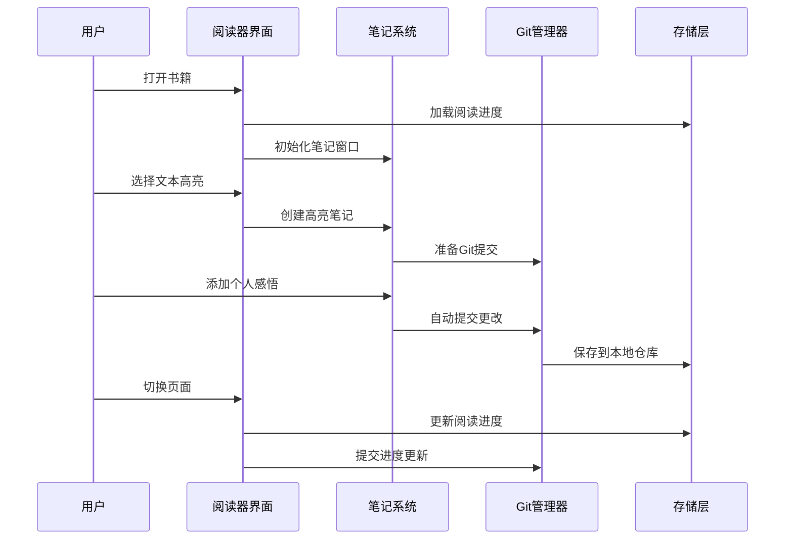
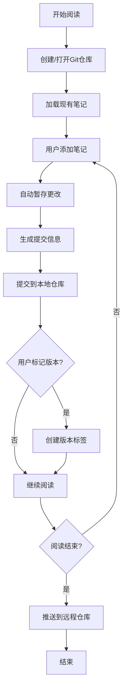

# 深度阅读器产品需求文档 (PRD)

## 核心目标 (Mission)
打造一款专注深度思考的跨平台阅读器，让阅读与思考无缝融合，通过Git版本管理构建个人知识体系。

## 用户画像 (Persona)
**目标用户：** 深度阅读者、学者、研究人员、知识工作者
**核心痛点：**
- 传统阅读器缺乏思考记录功能
- 笔记与阅读体验割裂
- 无法追溯思维发展过程
- 缺乏个性化的沉浸式阅读环境

## V1: 最小可行产品 (MVP)

### 核心功能列表
1. **本地书籍管理**
   - 支持PDF、EPUB、TXT格式
   - 书籍导入和组织
   - 阅读进度记录

2. **沉浸式阅读体验**
   - 完全自定义字体上传(.ttf, .otf, .woff)
   - 静态背景图片自定义
   - 护眼模式和夜间模式
   - 专注阅读界面

3. **实时笔记系统**
   - 独立笔记窗口
   - 边读边写功能
   - 高亮批注（支持颜色分类）
   - 个人感悟记录

4. **Git版本管理**
   - 笔记文档Git管理
   - 单本书版本控制
   - V1/V2功能版本标记
   - 本地仓库管理

5. **手动同步机制**
   - 本地数据存储
   - 手动导出/导入配置
   - 书籍和设置打包

## V2 及以后版本 (Future Releases)

### V2.0 - 智能化增强
- 云端同步服务
- AI辅助摘要生成
- 知识图谱可视化
- 跨书籍关联笔记
- 高级搜索功能

### V3.0 - 社交化学习
- 读书社区功能
- 笔记分享机制
- 协作阅读模式
- 专家点评系统

### V4.0 - 多媒体扩展
- 音频书支持
- 视频注释功能
- 语音笔记录入
- AR/VR阅读体验

## 关键业务逻辑 (Business Rules)

### 阅读会话管理
- 每次打开书籍创建新的阅读会话
- 会话包含：时间戳、阅读进度、新增笔记
- 会话自动保存，支持恢复

### 笔记版本控制
- 每本书对应独立Git仓库
- 笔记修改自动提交
- 支持分支管理不同阅读角度
- 版本标签标记重要里程碑

### 数据隔私保护
- 所有数据本地存储
- 笔记内容完全私密
- 无网络传输敏感信息
- 用户完全控制数据

## 数据契约 (Data Contract)

### 书籍数据结构
```json
{
  "bookId": "string",
  "title": "string",
  "author": "string",
  "filePath": "string",
  "format": "pdf|epub|txt",
  "lastReadPosition": "number",
  "createdAt": "datetime",
  "updatedAt": "datetime"
}
```

### 笔记数据结构
```json
{
  "noteId": "string",
  "bookId": "string",
  "type": "highlight|annotation|reflection",
  "content": "string",
  "position": "object",
  "color": "string",
  "createdAt": "datetime",
  "gitCommitId": "string"
}
```

### 用户设置数据
```json
{
  "theme": {
    "fontFamily": "string",
    "fontSize": "number",
    "backgroundColor": "string",
    "backgroundImage": "string"
  },
  "readingPreferences": {
    "nightMode": "boolean",
    "eyeCareMode": "boolean",
    "lineSpacing": "number"
  }
}
```

## MVP 原型设计方案

### 方案一：经典分屏布局
```
┌─────────────────────────────────────────────────────────────┐
│  📚 深度阅读器                                    ⚙️ 设置    │
├─────────────────────────────────────────────────────────────┤
│                                                             │
│  ┌─────────────────────┐  ┌─────────────────────────────┐   │
│  │                     │  │  📝 笔记区域                │   │
│  │                     │  │                             │   │
│  │     阅读区域        │  │  ┌─────────────────────────┐ │   │
│  │                     │  │  │ 高亮文本："重要概念"   │ │   │
│  │   [选中文本高亮]    │  │  │ 💭 我的理解：...        │ │   │
│  │                     │  │  └─────────────────────────┘ │   │
│  │                     │  │                             │   │
│  │                     │  │  ┌─────────────────────────┐ │   │
│  │                     │  │  │ 📖 读后感悟             │ │   │
│  │                     │  │  │ 今天的阅读让我想到...   │ │   │
│  │                     │  │  └─────────────────────────┘ │   │
│  └─────────────────────┘  └─────────────────────────────┘   │
│                                                             │
├─────────────────────────────────────────────────────────────┤
│  📊 进度: 45%    🏷️ Git: v1.2    💾 自动保存    🔄 同步     │
└─────────────────────────────────────────────────────────────┘
```

### 方案二：沉浸式悬浮笔记
```
┌─────────────────────────────────────────────────────────────┐
│                    📚 沉浸式阅读模式                        │
│                                                             │
│                                                             │
│              这是一段重要的文字内容，用户可以              │
│              通过长按或双击来进行高亮标记，然后              │
│              在悬浮窗口中添加自己的理解和感悟。              │
│                                                             │
│                     ┌─────────────────┐                    │
│                     │  💭 快速笔记     │                    │
│                     │  ┌─────────────┐ │                    │
│                     │  │这段话让我想到│ │                    │
│                     │  │...          │ │                    │
│                     │  └─────────────┘ │                    │
│                     │  [保存] [展开]   │                    │
│                     └─────────────────┘                    │
│                                                             │
│                                                             │
├─────────────────────────────────────────────────────────────┤
│  ◀️ 上一页    📖 目录    🎨 主题    📝 笔记本    ▶️ 下一页   │
└─────────────────────────────────────────────────────────────┘
```

### 方案三：标签页多任务布局
```
┌─────────────────────────────────────────────────────────────┐
│  📚《深度工作》 📝笔记本 🎨主题 ⚙️设置 📊统计              │
├─────────────────────────────────────────────────────────────┤
│  ┌─ 阅读视图 ─┐ ┌─ 笔记视图 ─┐ ┌─ 版本管理 ─┐            │
│  │             │ │             │ │             │            │
│  │   正文内容  │ │  📝 当前笔记│ │  🌿 main    │            │
│  │             │ │             │ │  └─ v1.2    │            │
│  │   [高亮区域]│ │  💡 灵感记录│ │  └─ v1.1    │            │
│  │             │ │             │ │             │            │
│  │             │ │  🔍 搜索笔记│ │  📝 提交历史│            │
│  │             │ │             │ │  - 添加重点 │            │
│  │             │ │  📋 笔记列表│ │  - 修正理解 │            │
│  │             │ │  • 第1章感悟│ │  - 初始笔记 │            │
│  │             │ │  • 重要概念 │ │             │            │
│  └─────────────┘ └─────────────┘ └─────────────┘            │
│                                                             │
├─────────────────────────────────────────────────────────────┤
│  📍 第3章 P.45  ⏱️ 已读30分钟  💾 已保存  🔄 本地模式      │
└─────────────────────────────────────────────────────────────┘
```

## 架构设计蓝图

### 核心流程图

#### 阅读与笔记同步流程


#### Git版本管理流程


### 组件交互说明

#### 核心模块架构
```
阅读器应用
├── 前端界面层
│   ├── 阅读组件 (ReadingView)
│   ├── 笔记组件 (NoteEditor)
│   ├── 设置组件 (SettingsPanel)
│   └── 主题组件 (ThemeManager)
├── 业务逻辑层
│   ├── 书籍管理器 (BookManager)
│   ├── 笔记管理器 (NoteManager)
│   ├── Git管理器 (GitManager)
│   └── 同步管理器 (SyncManager)
├── 数据访问层
│   ├── 本地存储 (LocalStorage)
│   ├── 文件系统 (FileSystem)
│   └── Git仓库 (GitRepository)
└── 工具层
    ├── 字体加载器 (FontLoader)
    ├── 主题引擎 (ThemeEngine)
    └── 导入导出 (ImportExport)
```

#### 模块间调用关系
- **ReadingView** ↔ **NoteEditor**: 实时同步选中文本和笔记
- **NoteManager** → **GitManager**: 笔记变更自动提交
- **BookManager** → **LocalStorage**: 书籍元数据持久化
- **ThemeManager** → **ThemeEngine**: 主题样式应用
- **SyncManager** → **FileSystem**: 手动同步数据导出

### 技术选型与风险

#### 核心技术栈
- **前端框架**: Electron + React (跨平台桌面应用)
- **状态管理**: Redux Toolkit (复杂状态管理)
- **文档渲染**: PDF.js + ePub.js (多格式支持)
- **Git集成**: isomorphic-git (纯JS Git实现)
- **本地存储**: SQLite + IndexedDB (结构化数据)
- **字体处理**: FontFace API (动态字体加载)

#### 潜在技术风险

1. **性能风险**
   - 大文件PDF渲染可能卡顿
   - 实时Git操作影响响应速度
   - **缓解方案**: 虚拟滚动、异步处理、增量渲染

2. **兼容性风险**
   - 不同格式书籍解析差异
   - 字体文件格式兼容性
   - **缓解方案**: 格式标准化、字体格式转换

3. **数据安全风险**
   - 本地数据损坏
   - Git仓库冲突
   - **缓解方案**: 定期备份、冲突解决机制

4. **用户体验风险**
   - 学习成本较高
   - Git概念对普通用户复杂
   - **缓解方案**: 简化界面、智能化Git操作

---

**文档版本**: v1.0  
**创建日期**: 2024年  
**最后更新**: 2024年  
**状态**: 待开发

> 这份PRD将作为开发团队的核心指导文档，所有功能开发都应严格按照此文档执行。
